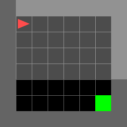
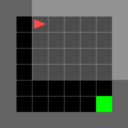
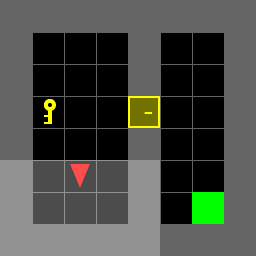

# Deep Reinforcement Learning Assignment 1

This notebook introduces the fundamentals of reinforcement learning through **Grid World** and **MiniGrid** environments. It begins with implementing a simple environment and basic agents, then moves to **tabular reinforcement learning**, and finally re-implements tabular methods using **PyTorch**.

The notebook is organized into three main parts.

---

## Part 1: Familiarizing with Grid World and Gym Environment

This part focuses on understanding how an agent interacts with an environment before applying reinforcement learning algorithms.

### Basic Implementation

A simple **3×3 Grid World** is implemented from scratch.  
This section introduces the core components of a reinforcement learning environment:

- `reset()` for initializing the environment
- `step()` for executing an action
- `render()` for visualizing the environment

Through this implementation, we understand how **states, actions, rewards, and termination conditions** are defined in a simple environment.

---

### Understanding MiniGrid

After building the custom Grid World, the notebook explores the **MiniGrid** environment from Gym.

This section demonstrates:

- how to initialize a Gym environment
- how to inspect the **action space** and **observation space**
- how rewards and transitions work in MiniGrid

This helps establish familiarity with Gym-style environments before implementing learning algorithms.

---

### Implementing a Random Agent

A **random agent** is implemented to interact with MiniGrid.

The agent selects actions uniformly at random without using any knowledge about the environment. Although simple, this agent serves as a **baseline** for comparing the performance of more intelligent agents later.

Total Reward: -1.780859375

---

### Implementing a Rule-Based Agent

A **rule-based agent** is then implemented using simple heuristics.

Compared with the random agent, it demonstrates how prior knowledge about the environment can improve performance. At the same time, it also shows the limitations of manually designed strategies.

Total Reward: 0.694140625

---

## Part 2: Reinforcement Learning with Tabular Methods

This part introduces **classical tabular reinforcement learning algorithms**.

Since MiniGrid environments have discrete state and action spaces, they are suitable for tabular approaches.
---

### Value-Based Learning

This section implements **Q-learning**, a value-based reinforcement learning method.

The agent maintains a **Q-table** that stores the estimated value of each state-action pair. During training, these values are updated using the Bellman equation.

Key ideas introduced in this section include:

- Q-value estimation
- the Bellman update rule
- balancing exploration and exploitation using **ε-greedy policy**

The agent is first trained in the **MiniGrid-Empty-8x8** environment.

Total Reward: 0.9578125

---

### Policy-Based Learning

This section introduces **tabular policy learning**, where the agent learns a policy directly instead of learning Q-values.

Unlike value-based methods, policy-based learning represents **action probabilities explicitly**, allowing the agent to behave stochastically and adapt its action distribution during learning.

Total Reward: 0.8734375

---

### Reward Shaping

The notebook then applies tabular Q-learning to a more challenging environment: **MiniGrid-DoorKey-8x8**.

Because the environment contains **sparse rewards**, learning becomes difficult. To address this, **reward shaping** is introduced to provide intermediate feedback that guides the agent toward useful behaviors, such as picking up the key and opening the door.

Reward shaping helps accelerate learning and improves training stability.

Total Reward: 0.9409375

---

## Part 3: Implementing Tabular Learning with PyTorch

The final part re-implements tabular reinforcement learning methods using **PyTorch**.

Although the algorithms remain tabular, using PyTorch provides a bridge toward **deep reinforcement learning implementations**.

---

### PyTorch Q-Learning

In this section, Q-learning is implemented using **PyTorch tensors**.

The implementation demonstrates how reinforcement learning updates can be integrated into a PyTorch workflow while preserving the same tabular learning principles.

---

### PyTorch Policy Learning

This section implements policy learning using a **softmax policy**.

A softmax policy converts action preferences into probabilities, allowing the agent to sample actions stochastically. This approach:

- encourages exploration
- maintains differentiability
- provides smoother policy updates

This section highlights the conceptual difference between **learning value functions** and **learning policies directly**.

Total Reward: 0.961328125

---

## Summary

This notebook provides a step-by-step introduction to reinforcement learning:

1. Build and understand a simple Grid World environment  
2. Explore Gym MiniGrid with random and rule-based agents  
3. Implement tabular value-based and policy-based learning methods  
4. Apply reward shaping in a more challenging environment  
5. Re-implement tabular reinforcement learning with PyTorch  

The notebook is designed to build intuition for reinforcement learning in a simple and interpretable setting before moving on to more advanced deep reinforcement learning methods.